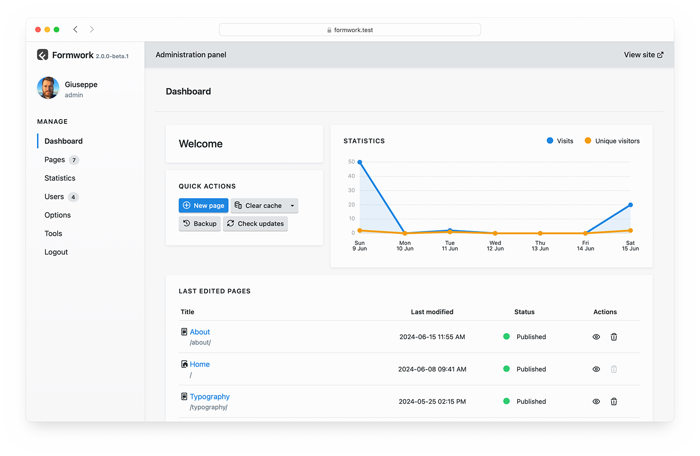

# Welcome to your Formwork site! 
You’re all set up — now what? Here are a few ideas to get started:

- Go to the [Administration Panel](/panel/) to create your first page or tweak settings.  
- Browse the [Documentation](https://getformwork.org/documentation/) to see how everything works.  
- Explore the `📁 site` folder — pages, templates, config — it's all there.  
- Join the community on [GitHub Discussions](https://github.com/getformwork/formwork/discussions/).  
- Don't forget to [star Formwork on GitHub](https://github.com/getformwork/formwork/) if you like it!

## Discover the Administration Panel
The [Administration Panel](/panel) makes easy editing pages, changing options and creating users.

You can always access it by visiting the [`/panel/`](/panel) page right at the site root.

At the first access you’ll be requested to register a new user.



### Manage Pages Manually
If you prefer to manage the content manually, just locate the pages in the subdirectories of `📁 site/pages` folder. Each subfolder is named by its slug with by an ordering number prefix, e.g., `01-about`.

The content of each page is stored in Markdown + YAML files with the `.md` extension and named after the template they use.

For example, an *About* page, using the `page` template and accessibile from the `/about/` route is represented by `site/content/01-about/page.md` file.

Each page is structured like this:

```
---
title: Page Title
# Optional fields like `publishDate`, `tags`, etc.
---
Page content here, using Markdown syntax.
```

YAML data between the `---` delimiters defines the page frontmatter, containing all the field values and metadata of the page. In the example above, `title` is a field with `"Page Title"` as value.